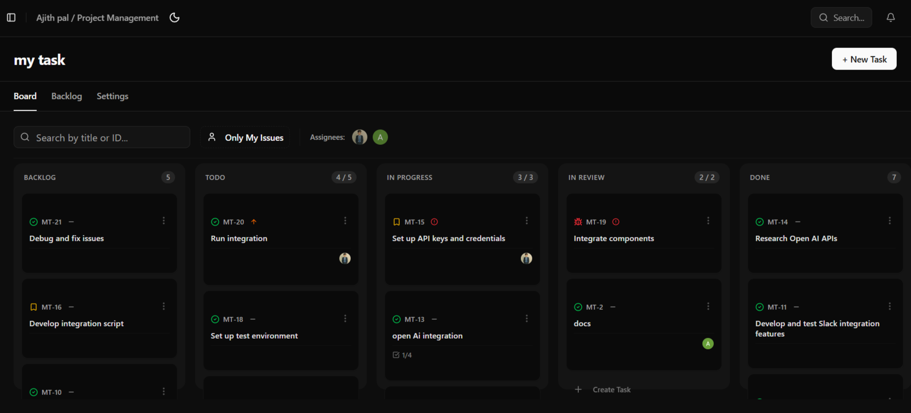
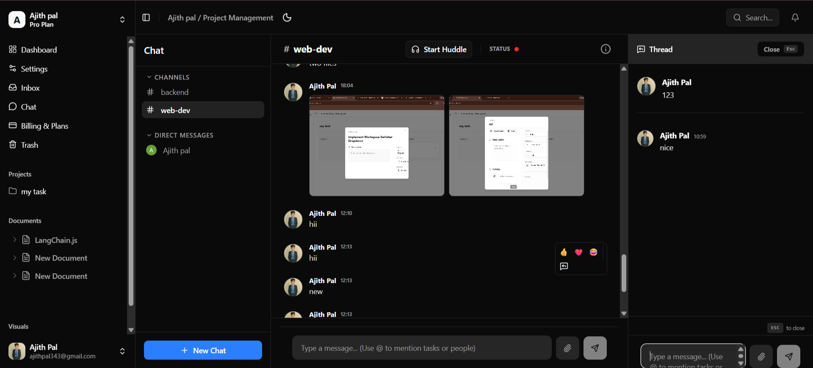
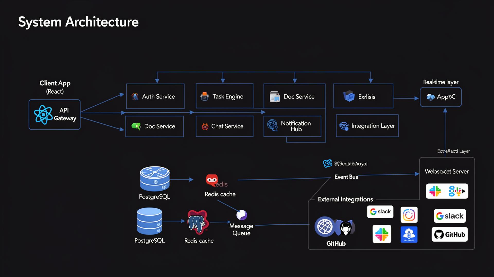

# 🚀 Ajith Pal — Founder-Level Portfolio

> Building scalable SaaS products with modern web technologies, real-time systems, and product-first engineering.

---

## 🌐 Live Portfolio

🔗 [https://ajith-pal-portfolio.vercel.app](https://ajith-pal-portfolio.vercel.app)

---

## 📌 About This Portfolio

This portfolio is designed to showcase:
* Production-level full-stack engineering skills
* SaaS product thinking and complex state management
* System design, background queues, and microservice-oriented architecture
* Real-world project execution with enterprise-grade observability

It is not just a portfolio, but a **product-oriented engineering showcase**.

---

## 🧠 What You’ll Find Here

* 🚀 In-Depth Case Study: Building a Real-Time Collaborative Canvas
* 🏗️ System Architecture & Database Design Thinking
* ⚡ WebSocket Integrations & Conflict-Free Replicated Data Types (CRDTs)
* 💻 Clean UI/UX with modern frontend tooling
* 📊 Scalable, secure backend structuring with custom RBAC

---

## 🛠️ Tech Stack

### Frontend Architecture
* **Framework:** Next.js (App Router) & React
* **Styling & UI:** Tailwind CSS, ShadCN UI
* **Interactive Canvas:** Tldraw
* **State & Real-Time:** Liveblocks (Yjs)

### Backend & Infrastructure
* **Server Framework:** Fastify (Node.js)
* **Real-time Engine:** WebSockets
* **Background Jobs:** BullMQ 
* **File Storage:** Uploadthing

### Database & Security
* **Database:** PostgreSQL (Neon Serverless)
* **ORM:** Prisma
* **Auth & Security:** Custom Session Auth, Role-Based Access Control (RBAC)

### DevOps & Observability
* **Hosting:** Docker, Vercel (Frontend), Render (Backend)
* **Telemetry & Logging:** Grafana Loki, OpenTelemetry (Tempo)
* **Version Control:** Git & GitHub

---

## 📂 Featured Project

### 🔥 TaskFlow — Scalable SaaS Productivity & Canvas Platform

> A real-time collaborative workspace bridging the gap between structured task management and free-form visual brainstorming.

**Key Engineering Achievements:**
* **Real-Time Multiplayer:** Engineered a low-latency collaborative whiteboard using Tldraw and Liveblocks, syncing cursors and drawing states across multiple clients seamlessly.
* **Custom RBAC Security:** Implemented a strict Role-Based Access Control system via Fastify middleware to manage permissions across Workspaces and Projects (Owner, Admin, Member, Viewer).
* **Asynchronous Processing:** Built robust background job queues using BullMQ to handle intensive tasks like canvas syncing and Liveblocks server cleanup without blocking the main API thread.
* **Enterprise Observability:** Integrated OpenTelemetry and Grafana Loki for centralized logging and trace monitoring across the distributed architecture.
* **Figma-Style Dashboard:** Designed a responsive, grid-based dashboard with automated canvas thumbnail generation and Uploadthing image hosting.

🔗 **Live Deployment:** [https://task-flow-web-seven.vercel.app](https://task-flow-web-seven.vercel.app)
🔗 **Source Code:** [TaskFlow GitHub Repo]

---

## 🏗️ Architecture & System Design

This portfolio highlights a deep focus on backend robustness and system design:

* **Decoupled Architecture:** Clean separation of concerns between the Next.js frontend delivery and the Fastify API backend.
* **API Design Patterns:** Strict schema validation and RESTful routing.
* **Real-time System Implementation:** CRDTs for resolving real-time editing conflicts on the whiteboard.
* **Scaling Considerations:** Utilizing serverless Postgres (Neon) and externalized message queues (BullMQ) to prepare for high-concurrency traffic.

📌 https://github.com/Ajithpal2007/TaskFlow/tree/main/docs 

**High-level architecture showing separation between the edge frontend and the monitored backend infrastructure.**


---

## 🎯 Vision

I aim to build:
* Scalable SaaS platforms
* Developer tools
* Real-time collaborative systems

**Long-term goal:**
> Build products that solve real-world problems at scale, prioritizing technical excellence and user experience.

---

## 📸 Screenshots

```md



```

---

## ⚙️ Installation & Setup

```bash
# Clone the repository
git clone https://github.com/Ajithpal2007/Ajith-Pal-portfolio.git

# Navigate to project
cd Ajith-Pal-portfolio

# Install dependencies
bun install

# Run the Next.js frontend
bun run dev

```


---

## 📬 Contact

* **Email:** ajithpal343@gmail.com
* **LinkedIn:** https://www.linkedin.com/in/ajith-pal-ab6525350
* **GitHub:** https://github.com/Ajithpal2007
* **Portfolio:** [https://ajith-pal-portfolio.vercel.app](https://ajith-pal-portfolio.vercel.app)

---

## 💡 Final Note

This portfolio represents my journey toward becoming a **product-focused, system-oriented engineer**. 

If you are building something interesting or looking for an engineer who understands both the UI layer and the backend infrastructure required to support it—let’s connect.